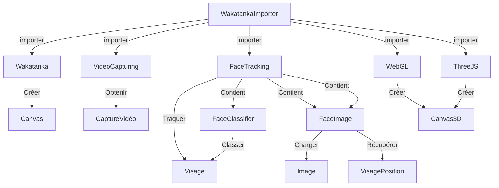

# Wakatanka - Readme

## Mise en route

Démarrer Wakatanka est un jeu d'enfant, il suffit de seulement de trois étapes :

### Etape 1

Importer le fichier "WakatankaImporter.js" avec une balise "script".

```html
<script src="../../Src/WakatankaImporter.js"></script>
```

### Etape 2

Choisir quelles fonctionnalités vous souhaitez utiliser.

```js
WakatankaImporter.loadVideoCapturing();
WakatankaImporter.loadFaceTracking();
WakatankaImporter.loadCanvas3D();
WakatankaImporter.loadThreeJS();
```

### Etape 3

3) Appeler la fonction permettant de changer automatiquement toutes ces fonctionnalités.

> Cette fonction nécéssite que vous lui donniez le chemin d'accès au dossier dans lequel est contenu la bibliothèque.

```js
WakatankaImporter.onImporting("../../Src/", function () {
    // Do somethings...
}
```

### Terminé !

Vous pouvez commencer à utiliser la bibliothèque comme illustré ci-dessus.

> Vous pouvez également remplacer les étapes 2 et 3 en appelant une fonction permettant de charger automatiquement toutes les fonctionnalités de la bibliothèque.

```js
WakatankaImporter.onImportAll("../../Src/", function() {
    // Do somethings...
});
```

## Les fonctionnalités de la bibliothèque



## Wakatanka

La fonctionnalité majeure de la bibliothèque est basée sur l'utilisation d'un Canvas dans lequel différents éléments pourront ensuite y être rendu.

## Importation

Cette fonctionnalité se chargera automatiquement avec les autres fonctionnalités, il n'est donc pas nécéssaire de la préciser.

## Utilisation

La première chose à faire est d'instancier la classe "Wakatanka" en précisant sa longueur et sa largeur :

```js
var wakatanka = new Wakatanka(1180, 663);
```

Vous pouvez le redimenssionner si-besoin :

```js
wakatanka.resize(800, 600);
```

Vous pouvez ensuite récupérer le canvas généré :

```js
var canvas = wakatanka.canvas;
```

Ou si vous préférez vous pouvez appeler la méthode "append()" qui ajoutera automatiquement le canvas à l'abre DOM :

```js
wakatanka.append();
```

Vous pouvez enfin déssiner d'autres éléments dans le canvas, tel que des videos, des images voir même d'autres canvas.

```js
wakatanka.draw(element);
```

Si vous voulez déssiner à chaque frames vous pouvez utiliser la fonction "requestAnimationFrame()", ou utiliser la fonction "onUpdate()" :

```js
wakatanka.onUpdate(function() {
    wakatanka.draw(element);
    // Do somethings else...
});
```

## Capture video

Wakatanka possède une classe permettant de faire une capture vidéo d'une camera.

### Importation

Commencez evidemment par charger cette fonctionnalité comme présenté ci-desous :

```js
WakatankaImporter.loadVideoCapturing();
```

### Utilisation

Commencez par instancier un objet VideoCapturing en précisant sa longueur et sa largeur.

> Vous pouvez utiliser la longueur et la largeur du canvas de l'objet wakatanka.

```js
var capture = new VideoCapturing(wakatanka.canvas.width, wakatanka.canvas.height);
```

Vous pouvez le rendimensionner par la suite :

```js
capture.resize(800, 600);
```

Enfin, lorsque vous souhaitez démarrer la capture video appelez ceci :

> Cette fonction executera la callback passée en paramètre lorsque l'utilisateur aura validé le démarrage de la capture.

```js
capture.onStart(function() {
    // Do somethings else...
});
```

## Face tracking

### Importation

```js
WakatankaImporter.loadFaceTracking();
```

### Utilisation

La première chose à faire est d'instancier la classe "FaceTracking" en précisant l'élément dans lequel vous souhaitez traquer un visage puis sa longueur et sa largeur :

``` {.js}
var faceTracking = new FaceTracking(capture.video, 1180, 663);
```

Vous pouvez le redimenssionner :

```js
faceTracking.resize(800, 600);
```

Ensuite, vous pouvez démarrer la traque.

> La fonction passée en paramètre s'executera au démarrage de la traque.

```js
faceTracking.onTrack(function() {
    // Do somethings else ...
});
```

Pour obtenir le résultat de la traque, utilisez cette fonction :

> Cette fonction retourne un réel comprit entre 0 et 1 où 1 signifira qu'un visage a été parfaitement détecté. Seulement, il est conseillé de considérer qu'il y a détection au dessus de 0.4.

```js
var trackingScore = faceTracking.getScore();
```

La fonction suivant permet d'optenir les paramètres du visage détecté, vous n'en aurez besoin que pour un unique cas.

```js
var trackingParams = faceTracking.getParameters();
```

Pour déssiner le visage détecté dans un canvas :

> Le visage sera représenté par des traits verts fins.

```js
faceTracking.drawFace2D(canvas);
```

Vous pouvez déssiner des images par dessus un visage détecté en passant en paramètre un objet FaceImage suivit de sa position et enfin du canvas dans lequel déssiner.

> (Voir la partie "FaceImage" pour en savoir plus).

```js
faceTracking.drawFace3D(faceImage, faceImagePoints, canvas);
```

## Face classifier

Vous pouvez comparer un visage détecté à l'aide du FaceTracking à des modèles de visage. Ceci vous permettra de détecter si par exemple, un visage est rond, ovage ou carré.

### Importation

Cette fonctionnalité fait partie du FaceTracking :

```js
WakatankaImporter.loadFaceTracking();
```

### Utilisation

Commencez par instancier un objet de la classe FaceClassifier :

```js
var faceClassifier = new FaceClassifier();
```

Ensuite il vous faudra ajouter des modèles en utilisant la fonction ci-dessous :

> Cette fonction nécéssite deux paramètres, le type qui ne sert qu'à l'affichage et les coefficients qui peuvent être obtenu à l'aide de l'outil "ModelConstructor" situé dans le dossier "Tools".

```js
faceClassifier.addModel("type", [0,1,2,3,4,5,6,7,8,9,10,11,12,13,14,15,16,17]);
```

Vous pouvez ensuite commencer la prédiction en envoyant en paramètre les paramètres du visage détecté :

> Voir la partie FaceTracking pour savoir comment récupérer les paramètres d'un visage détecté.

```js
faceClassifier.predict(faceParameters);
```

Une fois la prédiction lancée, vous pouvez obtenir les différents types :

> Cette fonction retourne un tableau de chaines de caractères qui sera vide par defaut.

```js
var types = faceClassifier.getResultTypes();
```

Vous pouvez aussi récupérer les pourcentages de chaque types :

> Cette fonction retourne un tableau de réels compris entre 0 et 1 où 1 signifi 100% de ressemblance.

```js
var results = faceClassifier.getResultValues();
```

Vous pouvez enfin obtenir LE type de modèle qui ressemble le plus au visage détecté :

> Ceci retourner une chaine de caractères avec le nom du type de modèle.

```js
var faceResult = faceClassifier.getResult();
```

## Face image

Cette fonctionnalité vous permet de charger une image danq laquelle se trouve un visage afin d'ensuite le déssiner par dessus un visage détecté.

### Importation

Cette fonctionnalité fait partie du FaceTracking :

```js
WakatankaImporter.loadFaceTracking();
```

### Utilisation

Commencez par instancier un objet de la classe FaceImage en précisant le chemin d'accès au fichier image :

```js
var faceImage = new FaceImage(monImage.png);
```

Ensuite vous pouver décider de ne faire autre chose que lorsque cette image sera importée :

```js
faceImage.onLoad(function(){
    // Do somethings else...
});
```

Enfin, vous pouvez récupérer la position du visage contenu dans cette image :

> Cette fonction retourne le paramètre nécéssaire pour déssiner une image sur un visage (voir la partie FaceTracking)

```js
var faceImagePosition = faceImage.getPositions();
```

## Face deformer

Cette classe fait partie de la classe FaceTracking, vous n'avez pas besoin de l'utiliser.

## Face model

Cette classe fait également partie de la classe FaceTracking, vous n'avez pas besoin de l'utiliser.

## WebGL

Cette partie permet d'obtenir un rendu en 3D en utilisant les fonctionnalités pures de WebGL. Elle est incomplête et exige des connaissances en WebGL, mais elle peut être utilisée comme base. A contrario, vous pouvez utiliser la partie ThreeJS.

### Importation

```js
WakatankaImporter.loadWebGL();
```

### Utilisation

Commencez par instancier un objet de la classe Canvas3D en précisant sa longueur et sa largeur :

```js
var canvas3D = new Canvas3D(800, 600);
```

Vous pouvez le redimenssionner :

```js
canvas3D.resize(1280, 720);
```

Ce canvas3D peut rendre différentes scènes qui vous faut préalablement instancier :

```js
var scene = new Scene();
```

Vous pouvez modifier la couleur de fond de la scène :

```js
scene.backgroundColor = [0.8, 0.8 ,0.8]; // [r,g,b]
```

Une scène possède avant tout une caméra qu'il faut instancier :

> Une caméra possède un Transform, un FOV, une distance de vue minimale et une distance de vue maximale.

```js
var camera = new Camera();
```

Vous pouvez récupérer la matrice de projection :

> Cette matrice peut être envoyée à un shader pour calculer de la perspective.

```js
var projectionMatrix = camera.getPerspectiveProjection();
```

Cette nouvelle caméra peut ensuite être ajouté à une scène :

```js
scene.setCurrentCamera(camera);
```

Une scène est composée d'objets 3D que vous pouvez instancier :

```js
var object3D = new Object3D();
```

Les caméra et les objets 3D possèdent un transform qui contient les coordonnées de position de rotation et d'echelle sur les 3 axes que sont x, y et z :

```js
object3D.transform.position = [0, 0, 0];
object3D.transform.rotation = [0, 0, 0];
object3D.transform.scale = [1, 1, 1];

camera.transform.position = [0, 0, 0];
camera.transform.rotation = [0, 0, 0];
camera.transform.scale = [1, 1, 1];
```

Ce transform peut être mis à jour dans le processus de rendu :

> Cette fonction demande un contexte webgl qui est généré par l'objet Canvas3D.
> Cette fonction est exécutée automatiquement pour chaque objets de la scène dans les fonction init() et render() de l'objet Canvas3D. Vous n'avez donc pas besoin de l'appeler manuellement.

```
object3D.updateTransform(gl);
```

Un objet 3D possède également un Mesh que vous devez créer :

```js
var mesh = new Mesh();
```

Ce mesh est composé de deux paramètres, les vertices et les indices que vous devez définir :

> Cette notion de la 3D est impérative pour pouvoir construire des modèles ici. L'exemple ci-dessous permet de construire un cube, les vertices sont la position sur les trois axes de chaque sommets d'un modèle, les indices sont les indices des vertices entre lesquels une forme sera déssinée, ici il s'agit d'un triangle, donc tous les trois indices forment un triangle. Si vous préférez importer des modèles depuis un logiciel de modélisation, vous pouvez utiliser les fonctionnalités de ThreeJS de cette bibliothèque.

> Chaque mesh peut être utilisé autant de fois que vous le désirez pour des objets 3D différents.

```js
mesh.vertices = [-1, -1, -1, -1, -1, 1, -1, 1, 1, -1, 1, -1, 1, -1, -1, 1, -1, 1, 1, 1, 1, 1, 1, -1];
mesh.indices = [0, 1, 2, 0, 2, 3, 1, 5, 6, 1, 6, 2, 5, 4, 7, 5, 7, 6, 4, 0, 3, 4, 3, 7, 6, 7, 3, 6, 3, 2, 0, 5, 1, 0, 4, 5];
```

Un objet 3D possède aussi un shader qui est instancié de base, mais vous pouvez toujours en créer de nouveaux :

```js
var shader = new Shader();
```

Un shader est composé de deux paramètres qui sont les codes GLSL respectifs des parties Vertex et Fragment que vous pouvez obtenir ainsi :

> Les codes GLSL font partit d'un language spécifique à WebGL.

```js
shader.vertexCode;
shader.fragmentCode;
```

Un objet 3D possède également un couleur principale qui est utilisée par le shader de base que vous pouvez modifier ainsi :

```js
object3D.mainColor = [1, 0, 0, 1]; // [r, g b, a]
```

Vous pouvez définir la scène actuelle :

```js
canvas3D.setCurrentScene(scene);
```

Vous pouvez ajouter les objets 3D :

```js
scene.addObject3D(object3D);
```

Vous pouvez initialiser l'ensemble des éléments (scène, objets ...) :

```js
canvas3D.init();
```

Ensuite vous pouvez effectuer un rendu complêt :

```js
canvas3D.render();
```

## ThreeJS

Cette partie permet de créer des rendu en 3D, mais à defaut de la partie WebGL, elle est plus accessible.

### Importation

```js
WakatankaImporter.loadThreeJS();
```

### Utilisation

Commencez par instancier un objet ThreeJS en précisant la longueur et la largeur :

```js
var canvas3D = ThreeJS(800, 600);
```

Vous pouvez ajouter un skybox en précisant le chemin d'accès au fichier ainsi que le format des fichiers :

> Chaque fichier image doivent respecter le nom suivant : px, py, pz, nx, ny, nz.

```js
canvas3D.setBackground("skyFolder/", "png");
```

Vous pouvez aussi ajouter un ciel procédural :

> Cette fonctionnalité peut ne pas fonctionner.

```js
canvas3D.addSky();
```

Vous pouvez ajouter différentes grilles en précisant leur taille : 

```js
var grid = canvas3D.addGrid(10);
```

```js
var grid = canvas3D.addGlobalGrid(10);
```

Vous pouvez hiérarchiser vos objets en créant des groupes :

```js
var group = canvas3D.addGroup();
```

Ajouter des cubes en précisant la taille sur les axes x, y, z ainsi que si il est affecté par les ombres.

```js
var cube = canvas3D.addCube(1, 1, 1, true);
```

Ajouter des spères en précisant le rayon et le nombre de segments ainsi que si elle est affectée par les ombres.

```js
var sphere = canvas3D.addSphere(1, 10, true);
```

Ajouter des plans en précisant la taille sur les axes x, y, z ainsi que si il est affecté par les ombres.

```js
var plane = canvas3D.addPlane(1, 1, 1, true);
```

Ajouter des plans mirror en précisant la taille sur les axes x, y, z.

```js
var mirrorPlane = canvas3D.addPlaneMirror(1, 1, 1);
```

Ajouter des cercle mirror en précisant le rayon et le nombre de segments.

```js
var circleMirror = canvas3D.addCircleMirror(1, 10);
```

Vous pouvez ajouter une lumière d'ambiance en précisant la couleur :

```js
var ambientLight = canvas3D.addAmbientLight(0xFFFFFF);
```

Vous pouvez ajouter une lumière d'ambiance hemispherique en précisant la couleur :

```js
var hemiLight = canvas3D.addHemiLight(0xFFFFFF);
```

Vous pouvez ajouter une lumière directionnelle en précisant la couleur :

```js
var directionnalLight = canvas3D.addDirectionnalLight(0xFFFFFF);
```

Vous pouvez ajouter une lumière point en précisant la couleur, le rayon ainsi que la projection d'ombres :

```js
var pointLight = canvas3D.addPointLight(0xFFFFFF, 5, true);
```

Vous pouvez ajouter un effet d'image SAO :

```js
canvas3D.addSao();
```

Vous pouvez ajouter un effet d'image de flou lumineux :

```js
canvas3D.addBloom();
```

Vous pouvez ajouter un effet d'image film :

```js
canvas3D.addFilm();
```

Vous pouvez importer un modèle 3D ne précisant le chemin d'accès et la fonction callback à appeler quand le modèle sera chargé :

```js
var mesh = canvas3D.importMesh("monfichier.fbx", function() {
    // Do somethings else...
});
```

Vous pouvez créer une texture en précisant le chemin d'accès au fichier :

```js
var texture = canvas3D.importTexture("monfichier.jpg");
```

Vous pouvez créer un materiel réaliste en précisant la couleur, la rugosité et le métalisme :

```js
var material = canvas3D.standardMaterial(0xFFFFFF, 1, 0);
```

Vous pouvez enfin effectuer un rendu :

```js
canvas3D.render();
```

## Crédits

La bibliothèque Wakatanka, est composée de cette documentation en deux exemplaires, de fichiers sources en javascript, d'une suite d'application d'exemple en HTML et javascript puis d'une application de création de modèles de visage.

L'intégralité du contenu de la bibliothèque Wakatanka est la propriété de l'entreprise Studio Gazoline à Montpellier. Tous les droits d'utilisation, de suppréssion, de modification, d'édition, de publication, de diffusion, de protection et l'ensemble des autres droits reviennent à l'entreprise Studio Gazoline.

La bibliothèque a été entièrement développée par Tristan Muller.

A l'exception de certains fichiers image et des bibliothèques javascript clmtrackr et threejs.